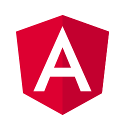

# About

For hot module reloading run

x~2~

y^2^

`npm run start:hmr`

## patrick@AngularClass.com

`this.localState = {{ localState | json }}`

This is [^me]

[^me]: I'm asnowwolf!

Term 1
:  This is Term1

Term 2
   ~ test
   
*[HTML]: this is a markup
HTML is a great language

:):cry:

this is a test;

++a++

==mark==